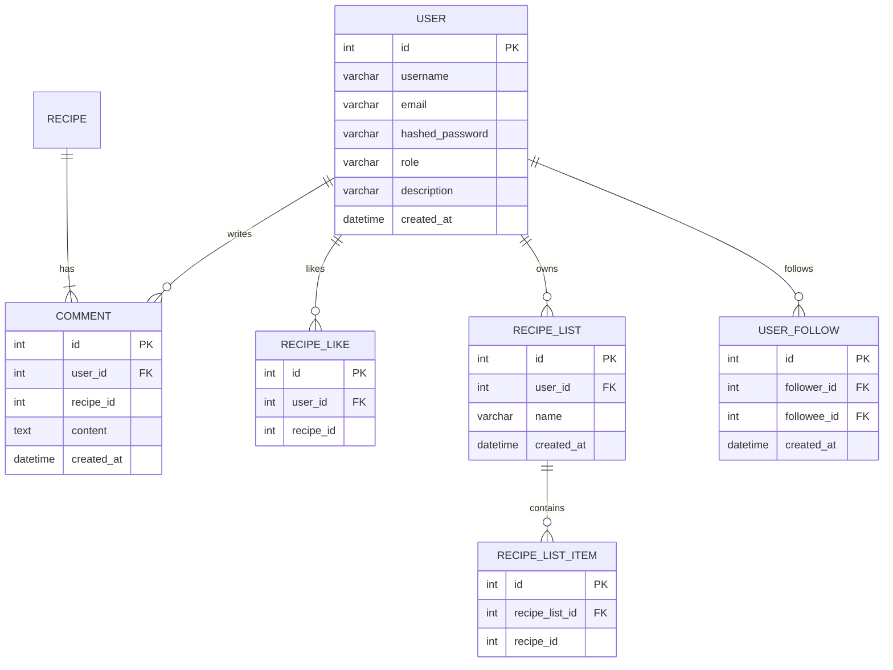

```mermaid
erDiagram

  USER ||--o{ COMMENT : writes
  USER ||--o{ RECIPE_LIKE : likes
  USER ||--o{ RECIPE_LIST : owns
  USER ||--o{ USER_FOLLOW : follows

  RECIPE ||--|{ COMMENT : has
  RECIPE_LIST ||--o{ RECIPE_LIST_ITEM : contains

  USER {
    int id PK
    varchar username
    varchar email
    varchar hashed_password
    varchar role
    varchar description
    datetime created_at
  }

  COMMENT {
    int id PK
    int user_id FK
    int recipe_id
    text content
    datetime created_at
  }

  RECIPE_LIKE {
    int id PK
    int user_id FK
    int recipe_id
  }

  RECIPE_LIST {
    int id PK
    int user_id FK
    varchar name
    datetime created_at
  }

  RECIPE_LIST_ITEM {
    int id PK
    int recipe_list_id FK
    int recipe_id
  }

  USER_FOLLOW {
    int id PK
    int follower_id FK
    int followee_id FK
    datetime created_at
  }
```