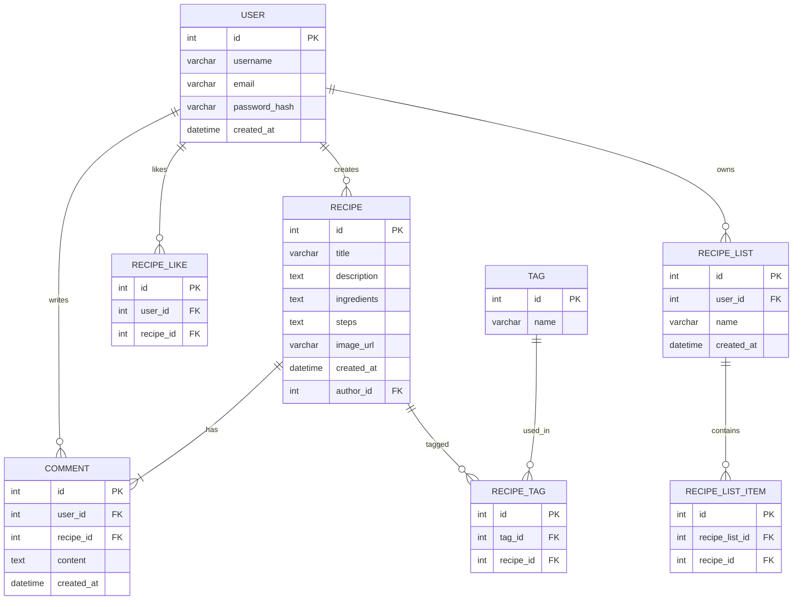

```mermaid
erDiagram

  USER ||--o{ RECIPE : creates
  USER ||--o{ COMMENT : writes
  USER ||--o{ RECIPE_LIKE : likes
  USER ||--o{ RECIPE_LIST : owns

  RECIPE ||--|{ COMMENT : has
  RECIPE ||--o{ RECIPE_TAG : tagged
  TAG ||--o{ RECIPE_TAG : used_in
  RECIPE_LIST ||--o{ RECIPE_LIST_ITEM : contains

  RECIPE {
    int id PK
    varchar title
    text description
    text ingredients
    text steps
    varchar image_url
    datetime created_at
    int author_id FK
  }

  USER {
    int id PK
    varchar username
    varchar email
    varchar password_hash
    datetime created_at
  }

  COMMENT {
    int id PK
    int user_id FK
    int recipe_id FK
    text content
    datetime created_at
  }

  RECIPE_LIKE {
    int id PK
    int user_id FK
    int recipe_id FK
  }

  RECIPE_LIST {
    int id PK
    int user_id FK
    varchar name
    datetime created_at
  }

  RECIPE_LIST_ITEM {
    int id PK
    int recipe_list_id FK
    int recipe_id FK
  }

  TAG {
    int id PK
    varchar name
  }

  RECIPE_TAG {
    int id PK
    int tag_id FK
    int recipe_id FK
  }
```