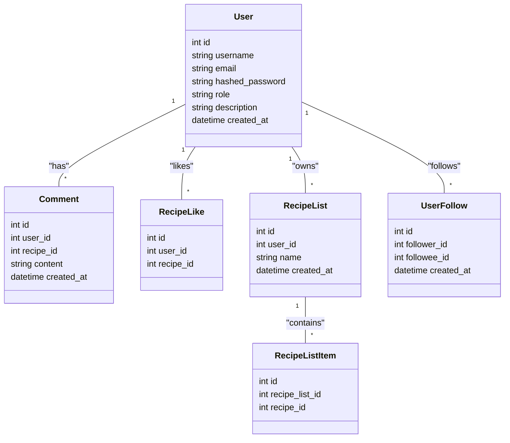

```mermaid
classDiagram
    class User {
        int id
        string username
        string email
        string hashed_password
        string role
        string description
        datetime created_at
    }

    class Comment {
        int id
        int user_id
        int recipe_id
        string content
        datetime created_at
    }

    class RecipeLike {
        int id
        int user_id
        int recipe_id
    }

    class RecipeList {
        int id
        int user_id
        string name
        datetime created_at
    }

    class RecipeListItem {
        int id
        int recipe_list_id
        int recipe_id
    }

    class UserFollow {
        int id
        int follower_id
        int followee_id
        datetime created_at
    }

    User "1" -- "*" Comment : "has"
    User "1" -- "*" RecipeLike : "likes"
    User "1" -- "*" RecipeList : "owns"
    RecipeList "1" -- "*" RecipeListItem : "contains"
    User "1" -- "*" UserFollow : "follows"
```